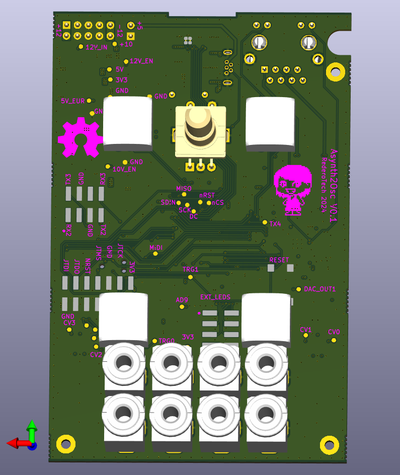

.. _asynthosc_board:

RederoTech AsyntOsc
################

Overview
********

This modular synthetizer module allows to convert analog CV signals
to the UDP OSC protocol, in order to directly connect modular synths modules
to modern network-based stage controls

It includes a user interface with screen, buttons, and LEDs.

It is programmed with an ST-Link probe, not embedded on board.

Key Features

- STM32H743 microcontroller in LQFP100 package
- Ethernet compliant with IEEE-802.3-2002 (depending on STM32 support)
- USB OTG or full-speed device (depending on STM32 support)
- Central rotary quadrature encoder with pushbutton
- 4 arcade-like pushbuttons with retrolights
- 8 mini-jack inputs, 12V or 5V tolerant
- 128x64 OLED display
- 2 debug LEDs
- 1 debug reset button
- Board connectors:

 - USB with Micro-B
 - SWD
 - Ethernet RJ45 (depending on STM32 support)
 - Optional connector, prevision for front panel board with LEDs.

- Flexible power-supply options: USB VBUS, external 5V, or Eurorack 12V

More information about the board can be found on the `AsynthOsc repository`_.

Hardware
********

- Main MCU: ST STM32H743VIT
- Ethernet PHY: Microchip LAN8742A
- External storage: Winbond W25Q32JVSS (32Mb SPI flash)
- Op amps: LM2902
- MIDI in optocoupler: 6N138
- Display module: NewVisio X154-2864KSWBG01-C24
- Display module controller: Winstar CH1116 (equivalent to SSD1309)

Supported Features
==================

Default Zephyr Peripheral Mapping:
----------------------------------

Board is configured as follows:

- UART4 RX MIDI in: PD0
- Buttons 1, 2 inputs: PD2, PD12
- Button 1, 2 LEDs: PD3, PD11
- Rotary encoder A, B: PD14 (TIM4_CH3), PC8 (TIM3_CH3, TIM8_CH3): Issue
 90: TIM3 CH1 (remove nRST jumper and solder to ROT B)
 91: TIM3 CH2 is FREE, can also be exchanged with 90 to ease routing
- Rotary encoder pushbutton: PA8
- Display power enable: PD9 (from 5V)
- Display SPI2 MOSI, MISO, SCK, nCS: PB15, PB14, PB10, PC7
- Display GPIO nRST, DC: PC6, PD15
- RMII: PA1, PA2, PA7, PB12, PB13, PC4, PC5
- QSPI flash IO0, IO1, IO2, IO3, CLK, BK1NCS: PC9, PC10, PE2, PD13, PB2, PB6
- External connector for LEDs 1, 2, 3, 4, 5, 6: PE4, PB8, PE3, PB9, PE1, PE0
- USB DN, DP: PA11, PA12

- Debug LED: PC2C
- Debug UART2 TX, RX: PD5, PD6

- CV input 1, 2, 3, 4: PA0 (ADC1 IN0), PA3 (ADC1 IN5), PA5 (ADC IN6), PC0 (ADC1 IN9)
- Trigger input 1, 2: PE13 (TIM1 CH3), PE14 (TIM1 CH4)
- DAC output: PA4 (DAC OUT1)

System Clock
------------

By default, the System clock is driven by the PLL clock at 96MHz,
driven by an 8MHz high-speed external clock.

Serial Port
-----------

The Zephyr console output is
assigned to UART2, on connector J5.
Default settings are 115200 8N1.

Programming and Debugging
*************************

This board can be programmed and debuggued with an SL-Link V2 probe.

Applications for the ``asynthosc`` board configuration can be built and
flashed in the usual way (see :ref:`build_an_application` and
:ref:`application_run` for more details).

Flashing
========

The board is configured to be flashed using west `STM32CubeProgrammer`_ runner,
so its :ref:`installation <stm32cubeprog-flash-host-tools>` is required.

Alternatively, OpenOCD, JLink or pyOCD can also be used to flash the board using
the ``--runner`` (or ``-r``) option:

.. code-block:: console

   $ west flash --runner openocd
   $ west flash --runner jlink
   $ west flash --runner pyocd

Flashing an application to AsynthOsc
------------------------------------

Here is an example for the :ref:`hello_world` application.

Run a serial host program to connect with your Nucleo board.

.. code-block:: console

   $ minicom -b 115200 -D /dev/ttyACM0

Build and flash the application:

.. zephyr-app-commands::
   :zephyr-app: samples/hello_world
   :board: asynthosc
   :goals: build flash

You should see the following message on the console:

.. code-block:: console

   $ Hello World! asynthosc

Debugging
=========

You can debug an application in the usual way.  Here is an example for the
:ref:`hello_world` application.

.. zephyr-app-commands::
   :zephyr-app: samples/hello_world
   :board: asynthosc
   :maybe-skip-config:
   :goals: debug

.. _AsynthOsc repository:
   https://github.com/everedero/asynth2osc

.. _STM32CubeProgrammer:
   https://www.st.com/en/development-tools/stm32cubeprog.html
